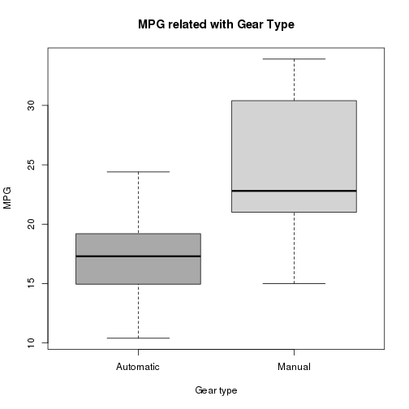

## This is the first slide

1. With slidify it is easy to create slide presentations for your data products
2. you can write it directly with R markdown

--- .class #id

## Embleming code

You can also write R code like a normal R markdown

```r
data(mtcars)
mtcars$am = as.factor(mtcars$am)
levels(mtcars$am) = c("Automatic", "Manual")
boxplot(mpg~am, data = mtcars,
        col = c("dark grey", "light grey"),
        xlab = "Gear type",
        ylab = "MPG",
        main = "MPG related with Gear Type")
```

---

## Ploting

Here is the result for the previous slide

 


---
## Deepening your knowlodge

To increse your knowledge wirh creating data products, visit the "Developing Data Products" course on 

http://www.coursera.org

Thank you very much
